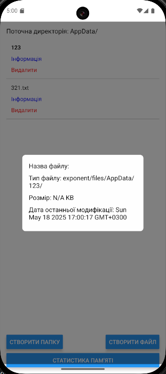

## Get started

1. Install dependencies

   ```bash
   npm install
   ```

2. Start the app

   ```bash
    npx expo start
   ```

## Screenshots (Android)
<details>
  <summary>Screen1</summary>

  
</details>
<details>
  <summary>Screen2</summary>

  
</details>
<details>
  <summary>Screen3</summary>
  
  
</details>
<details>
  <summary>Screen4</summary>
  
  
</details>
<details>
  <summary>Screen5</summary>
  
  
</details>
<details>
  <summary>Screen6</summary>
  
  
</details>


